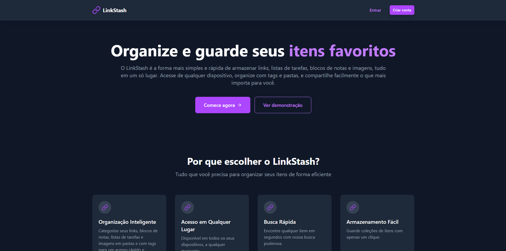

# 🔗📚 LinkStash - Sua Biblioteca Digital Pessoal
`Desenvolvido por:` Vinícius Lima



**LinkStash** *é uma aplicação web moderna para **organizar** e **gerenciar** todos os seus itens digitais importantes em um só lugar. Guarde **links**, **notas**, **listas de tarefas** e **imagens** com facilidade e **acesse de qualquer dispositivo.***


## **🌐 Demonstração**

`🔗 Acesse o projeto em:` ***https://www.linkstash.com.br***


## **✨ Recursos Principais**

- **Armazenamento de *links favoritos*, *notas*, *listas de tarefas* e *galeria de imagens***

- **Busca avançada com filtros por tipo, data e tags**
- **Autenticação segura com Firebase Auth**
- **Design responsivo com temas customizáveis e animações suaves**
- **Sincronização em tempo real com Firestore**

## **⚙️ Tecnologias Utilizadas**

### `Frontend`

- **⚛️ React.js** 

- **🧭 React Router** 

- **🎨 Tailwind CSS**

- **🎞️ Framer Motion**

- **🔔 React Icons**

- **🎯 Sonner**

### `Backend + Outros`
- 🔥 **Firebase** 

  - ***Firestore*** 
  - ***Auth*** 
  
- 📄 **Vite**

- ⚙️ **.env**

- ▲ **Vercel**


## **🚀 Como Usar**

- ### `🔐 Autenticação`
    - **Registro completo com *e-mail*, *telefone* e *senha***
    - **Login persistente**
    - **Recuperação de senha via *e-mail***

- ### `📊 Dashboard`
    - **Adicionar: *links*, *notas*, *listas*, *imagens***
    - **Visualização e edição em tempo real**
    - **Filtros, busca e organização** 

- ### `👤 Perfil`
    - ***Avatar* e *banner* personalizados**
    - **Bio e badges *(gamificação futura)*** 

- ### `⚙️ Configurações`
    - **Alteração de senha**  
    - **Exclusão de conta com confirmação** 

## 💻 Instalação Local
Para executar o projeto localmente, siga os passos abaixo:

- ### `Pré-requisitos`
    - **Node.js `(v16 ou superior)`**
    - **npm ou yarn**  
    - **Conta no Firebase**

**1. Clone o repositório:**

```bash
git clone https://github.com/inkmors/LinkStash.git
cd linkstash
```
**2. Instale as dependências:**

```bash
npm install
```
**3. Inicie o servidor de desenvolvimento:**

```bash
npm run dev
```

**4. Crie um `.env` na raiz com as suas chaves do Firebase:**

```bash
VITE_FIREBASE_API_KEY=your-key
VITE_FIREBASE_AUTH_DOMAIN=your-domain
VITE_FIREBASE_PROJECT_ID=your-project-id
VITE_FIREBASE_STORAGE_BUCKET=your-bucket
VITE_FIREBASE_MESSAGING_SENDER_ID=your-sender-id
VITE_FIREBASE_APP_ID=your-app-id
```
**5. Acesse a aplicação:**
```bash
Abra seu navegador e acesse http://localhost:3000 (ou a porta configurada).
```

## 📁 Estrutura do Projeto
```bash
link-stash/
    ├── public/
    ├── src/
    │   ├── assets/  #  Imagens, favicon, etc,
    │   ├── components/  # Componentes reutilizáveis do React,
    │   ├── contexts/  # Contextos globais (ex: AuthContext, ThemeContext),
    │   ├── hooks/  # Hooks personalizados (ex: useAuth, useStorage),
    │   ├── pages/  # Páginas da aplicação (ex: Home, Login, Dashboard),
    │   ├── App.jsx  # Componente principal da aplicação,
    │   ├── firebase.js  # Configuração e inicialização do Firebase,  
    │   ├── main.css  # Estilos globais e configurações do Tailwind,
    │   └── main.jsx  # Ponto de entrada da aplicação,              
    ├── package.json  # Configurações, scripts e dependências do projeto,
    ├── index.html  # Arquivo HTML base da aplicação,
    └── README.md  # Documentação principal do projeto.
```   

## 🤝 Contribuição

Contribuições são bem-vindas! Se você encontrar algum `bug` ou tiver `sugestões para melhorias`, por favor abra uma `issue` ou envie um `pull request`.

        1. Faça um fork do repositório.

        2. Crie uma branch com a sua feature (git checkout -b minha-feature).
        
        3. Faça o commit das suas alterações (git commit -m 'Minha nova feature').

        4. Envie a branch (git push origin minha-feature).

        5. Abra um Pull Request.

## 📄 Licença

**Distribuído sob a licença *MIT***.  
*Consulte o arquivo `LICENSE` para mais informações.*


## 📧 Contato

- `Instagram:` — ***[@morusu.ink](https://instagram.com/morusu.ink)***  
- `Linkedin:` — ***[Vinícius Lima](https://www.linkedin.com/in/vin%C3%ADcius-lima-738603284/)***  
- `GitHub:` — ***[@inkmors](https://github.com/inkmors)***
- `Email:` — ***gvlima.contato@gmail.com***
- `Link do projeto:` — ***[www.linkstash.com.br](https://www.linkstash.com.br)***

## Obrigado 🤍

